# SPC Player — Implementation Roadmap v2

**Status:** Accepted  
**Date:** 2026-03-21  
**Supersedes:** `docs/dev/implementation-roadmap.md` (Phases 1–5a remain historical record; this document governs all future work)  
**Audience:** Orchestrator agents and implementing agent teams

---

## Overview

This roadmap sequences all planned work from six planning documents into a unified, phased execution plan. Each phase produces a shippable product increment. Phases are strictly ordered on the critical path; independent tasks within each phase can be parallelized.

### Source Documents

| Document             | Location                                 | Scope                                                      |
| -------------------- | ---------------------------------------- | ---------------------------------------------------------- |
| UX Layout Redesign   | `docs/dev/plans/ux-layout-redesign.md`   | Shell grid, transport bar, sidebar, seek bar, drag-drop    |
| Audio Engine Plan    | `docs/dev/plans/audio-engine-plan.md`    | Checkpoint seeking, SoundTouch, export codecs, telemetry   |
| Feature Fixes Plan   | `docs/dev/plans/feature-fixes-plan.md`   | Bugs 1–3 (auto-advance, A-B loop, MIDI), subsumed seek bar |
| Visualization Plan   | `docs/dev/plans/visualization-plan.md`   | Piano roll, spectrum EQ, cover art, stereo field           |
| General Improvements | `docs/dev/plans/general-improvements.md` | Code quality, error handling, dead code, linting           |
| Documentation Plan   | `docs/dev/plans/documentation-plan.md`   | Help panel, architecture doc audit, contributing guide     |

### Review Documents

Review feedback has been incorporated into this roadmap and the source plans above. Original reviews were produced during the planning process and are not required for implementation.

---

## Resolved Decisions

The following decisions from the review cycle are resolved and binding. Do not revisit.

| Decision                           | Resolution                                                                                                                                                                                        | Rationale                                                                                                                                                                                                       |
| ---------------------------------- | ------------------------------------------------------------------------------------------------------------------------------------------------------------------------------------------------- | --------------------------------------------------------------------------------------------------------------------------------------------------------------------------------------------------------------- |
| **SharedArrayBuffer**              | NOT available on GitHub Pages. Primary path = postMessage with ArrayBuffer transfer for all cross-thread data. SAB is a future optimization gated on deployment platform migration. See ADR-0016. | GitHub Pages cannot set COOP/COEP HTTP headers. No reliable meta-tag workaround exists.                                                                                                                         |
| **IGDB cover art**                 | REMOVED from all plans. RetroArch thumbnails only, opt-in, behind Settings > Privacy.                                                                                                             | IGDB has no CORS support and requires a backend proxy with OAuth2 client secret — incompatible with no-backend architecture.                                                                                    |
| **lamejs**                         | NOT used. `wasm-media-encoders` (MIT) handles MP3 and OGG Vorbis encoding.                                                                                                                        | LGPL-3.0 license is the most restrictive option; library is unmaintained; `wasm-media-encoders` provides the same functionality under MIT.                                                                      |
| **SoundTouchJS**                   | Requires prototype validation before commitment. Build a standalone test page first. ADR-0019 to be written after validation.                                                                     | Low npm adoption (467 weekly downloads), unverified AudioWorklet performance, API discrepancies identified in research validation.                                                                              |
| **Cover art external fetch**       | Opt-in only, default disabled. RetroArch thumbnails fetched from `raw.githubusercontent.com` when user explicitly enables in Settings > Privacy.                                                  | Privacy — game title is sent to third-party server. CSP must be updated to allow `img-src https://raw.githubusercontent.com`.                                                                                   |
| **Bundle size budget**             | Raised from 210 KB to 250 KB (gzipped JS, excluding codecs/workers). See ADR-0018.                                                                                                                | Current headroom is 9.1 KB. Plans add ~15–22 KB. Code-splitting (React.lazy for viz, help dialog) offsets ~8–10 KB from critical path. Net total justified at 250 KB for a full-featured music player/analyzer. |
| **FFT computation**                | MUST use `AnalyserNode`, never worklet-side FFT.                                                                                                                                                  | 2048-point FFT per quantum would consume 20–40% of the 2.667 ms audio thread budget. `AnalyserNode` uses browser-native SIMD-optimized FFT.                                                                     |
| **OGG Vorbis export**              | Deferred to post-Phase F. If Opus via WebCodecs works, OGG is redundant.                                                                                                                          | Maintaining two lossy codec implementations is unnecessary. If WebCodecs is unavailable, display "format unavailable" with browser support guidance.                                                            |
| **Checkpoint "Instant" (1s) mode** | Removed. Only "Standard" (5s) and "Fast" (2s, desktop-only).                                                                                                                                      | 20 MB memory allocation is untenable on mobile. Standard + Fast covers 99% of use cases.                                                                                                                        |
| **Position sync frequency**        | Canvas-based seek bar reads `audioStateBuffer.positionSamples` directly at rAF rate. Zustand `position` syncs at ≤4 Hz for MediaSession and `aria-valuetext`.                                     | 60 Hz Zustand updates cause unnecessary subscriber notifications. The seek bar visual is the only 60fps consumer.                                                                                               |

---

## Performance Budgets

These budgets are enforced in CI via `scripts/check-bundle-sizes.mjs` and runtime telemetry.

| Metric                               | Budget                                       | Enforcement                                                  |
| ------------------------------------ | -------------------------------------------- | ------------------------------------------------------------ |
| Total JS (gzip, excl codecs/workers) | **250 KB**                                   | CI script (currently 210 KB; updated to 250 KB in Prelude 3) |
| React vendor (gzip)                  | 65 KB                                        | CI script                                                    |
| Largest route chunk (gzip)           | 50 KB                                        | CI script                                                    |
| WASM binary (raw)                    | 300 KB                                       | CI script                                                    |
| Worklet `process()` load             | < 60% of quantum (< 1.6 ms)                  | Runtime warn at 60%, error at 80%                            |
| Visualization frame budget           | < 6 ms total for all renderers               | `performance.now()` in shared rAF loop                       |
| Viz frame rate (mobile)              | 30 fps max                                   | Enforced in code                                             |
| JS heap peak (all features)          | < 30 MB (excl browser overhead)              | `performance.memory` monitoring                              |
| Checkpoint memory cap                | 8 MB (Standard), disabled above 5s on mobile | Enforced in worklet                                          |
| Canvas pixel memory                  | < 8 MB total (all canvases)                  | Zero inactive canvases                                       |
| CLS                                  | < 0.1                                        | Lighthouse verification                                      |

---

## Phase Summary

| Phase | Goal                                                                         | Depends On                    |
| ----- | ---------------------------------------------------------------------------- | ----------------------------- |
| **A** | Stabilization — bug fixes, error handling, no visual changes                 | Current codebase              |
| **B** | Layout Foundation — shell grid, transport bar, playlist sidebar              | Phase A                       |
| **C** | Seek & Performance — custom seek bar, checkpoint seeking                     | Phase B                       |
| **D** | Audio Engine & Export — time-stretching validation, export codecs, telemetry | Phase C (partial), WASM batch |
| **E** | Visualizations — piano roll, spectrum EQ, cover art                          | Phase B                       |
| **F** | Polish & Advanced — remaining features, documentation, onboarding            | Phases D + E                  |

---

## Cross-Cutting Preludes

These items span multiple phases and must be completed before the phases that depend on them.

### Prelude 1: AudioStateBuffer Full Target Interface (before Phase C)

Define the complete `AudioStateBuffer` interface that all plans extend. Three plans independently propose extensions — coordinate in a single interface update.

**File:** `src/audio/audio-state-buffer.ts`

**Existing fields** (from `src/audio/audio-state-buffer.ts`):

```typescript
interface AudioStateBuffer {
  positionSamples: number;
  vuLeft: Float32Array; // per-voice VU [0..7]
  vuRight: Float32Array; // per-voice VU [0..7]
  masterVuLeft: number;
  masterVuRight: number;
  voices: VoiceStateSnapshot[]; // array of { pitch, envelopeLevel, envelopePhase, keyOn, active, ... }
  echoBuffer: Int16Array | null;
  firCoefficients: Uint8Array;
  generation: number;
}
```

**New fields to add** (union of all plans):

```typescript
// Added by audio-engine plan (Phase D)
dspRegisters: Uint8Array; // 128 bytes — from dsp_get_registers()
cpuRegisters: {
  (a, x, y, sp, pc, psw);
}
ramCopy: Uint8Array; // 64 KB via postMessage transfer
processLoadPercent: number;
totalUnderruns: number;
```

**Task:** Define the interface extension in Prelude 1. Implement data flow for each new field in the phase that needs it (e.g., `dspRegisters` populated in Phase D when telemetry is built).

**Complexity:** S  
**Agent:** audio-engineer

### Prelude 2: Batched WASM Export Additions (before Phase D)

All WASM exports needed by Phases C–F must be added in a single Rust change to minimize build-pipeline friction.

**File:** `crates/spc-apu-wasm/src/lib.rs`, `src/audio/dsp-exports.ts`

**New exports required:**

| Export                                | Consumer                | Phase |
| ------------------------------------- | ----------------------- | ----- |
| `dsp_get_registers(outPtr) → u32`     | Telemetry (Phase D)     | D     |
| `dsp_get_cpu_registers(outPtr) → u32` | Telemetry (Phase D)     | D     |
| `dsp_get_ram_ptr() → u32`             | Memory viewer (Phase D) | D     |

**Note:** `dsp_snapshot` / `dsp_restore` / `dsp_snapshot_size` / `dsp_set_voice_mask` already exist. `dsp_get_register(addr)` (single register read) also exists — the proposed `dsp_get_registers(outPtr)` is a new batch export that copies all 128 registers at once for telemetry. The naming distinction is intentional.

**Complexity:** M  
**Agent:** wasm-engineer  
**Build note:** Always use `npm run build:wasm` (uses rustup's cargo, not Homebrew's). See repo memory.

### Prelude 3: Bundle Budget Update (before Phase B)

Update `scripts/check-bundle-sizes.mjs` to set the total JS budget to 250 KB (from 210 KB). Write ADR-0018 documenting the budget increase rationale. Add the script to the `validate` npm script if not already present. Add `/soundtouch/i` to `WORKER_PATTERNS` for future SoundTouchJS worklet exclusion.

**Complexity:** S  
**Agent:** build-engineer

### Prelude 4: LGPL Compliance Verification (before Phase D)

Only `@soundtouchjs/audio-worklet` (LGPL-2.1) requires LGPL compliance. Verify it is loaded via dynamic `import()` in a separate chunk:

- `@soundtouchjs/audio-worklet` — LGPL-2.1; must be loaded via dynamic `import()` (plan verified)
- `wasm-media-encoders` — MIT; no isolation required (loaded in export worker regardless)
- `libflac.js` — MIT; no isolation required

Update `THIRD_PARTY_LICENSES` with `@soundtouchjs/audio-worklet` LGPL-2.1 attribution. Run `npm audit`.

**Complexity:** S  
**Agent:** security-reviewer

---

### General Agent Instructions

All source plans are permanently available under `docs/dev/plans/`. Read the relevant plan documents before beginning each phase — they contain detailed specifications, wireframes, and implementation notes.

---

## Phase A: Stabilization

**Goal:** Fix all known bugs and critical code quality issues. No visual changes. The app looks identical after this phase but works correctly.

**Done criteria:**

- `npm run validate` passes (lint, typecheck, tests, build, E2E)
- All three bugs (auto-advance, A-B loop, MIDI shortcuts) verified fixed via new tests
- Error swallowing replaced with proper error reporting in 3 locations
- Service worker uses `import.meta.env.BASE_URL` instead of hardcoded paths

### Tasks

| #   | Task                                                                                                                                                               | Source                                    | Files                                                                                                                                               | Complexity | Parallel?     |
| --- | ------------------------------------------------------------------------------------------------------------------------------------------------------------------ | ----------------------------------------- | --------------------------------------------------------------------------------------------------------------------------------------------------- | ---------- | ------------- |
| A1  | Auto-advance hook — move `setOnPlaybackEnded` from `PlayerView` to root                                                                                            | feature-fixes Bug 1                       | Create `src/hooks/useAutoAdvance.ts`; modify `src/app/routes/__root.tsx`, `src/features/player/PlayerView.tsx`                                      | S          | ✅            |
| A2  | A-B loop units fix — convert samples→seconds in shortcut handlers                                                                                                  | feature-fixes Bug 2                       | Modify `src/shortcuts/GlobalShortcuts.tsx`                                                                                                          | S          | ✅            |
| A3  | A-B loop announcements — aria-live region announces loop activation/deactivation                                                                                   | feature-fixes Bug 2 Step 4                | Modify `src/shortcuts/GlobalShortcuts.tsx`; add `announcement: string` field and `setPlaybackAnnouncement` action to `src/store/slices/ui.ts`       | S          | Depends on A2 |
| A4  | Add `instrument.toggleKeyboard` to default keymap                                                                                                                  | feature-fixes Bug 2                       | Modify `src/shortcuts/default-keymap.ts`                                                                                                            | S          | ✅            |
| A5  | Wire `general.toggleInstrumentMode` in GlobalShortcuts                                                                                                             | feature-fixes Bug 3a                      | Modify `src/shortcuts/GlobalShortcuts.tsx`. Note: shortcut binding and keymap entry already exist — verify if only the store-side action is missing | S          | ✅            |
| A6  | ShortcutManager instrument mode bypass — skip non-reserved global shortcuts when instrument mode active                                                            | feature-fixes Bug 3b                      | Modify `src/shortcuts/ShortcutManager.ts`                                                                                                           | M          | Depends on A5 |
| A7  | Voice muting during seek (Phase 1 quick win) — mute voices during long backward seeks                                                                              | audio-engine §1.7                         | Modify `src/audio/spc-worklet.ts`                                                                                                                   | M          | ✅            |
| A8  | SW path fix — use `import.meta.env.BASE_URL` for SW registration and cache paths                                                                                   | general-improvements C-1                  | Modify `src/pwa/sw-registration.ts`, `src/sw.ts`, `vite.config.ts` (add `__BASE_URL__` define)                                                      | S          | ✅            |
| A9  | Error swallowing fix — replace silent catches with `reportError`                                                                                                   | general-improvements C-2, C-3             | Modify `src/store/store.ts`, `src/audio/engine.ts`                                                                                                  | S          | ✅            |
| A10 | `console.error` → `reportError` in audio-sync                                                                                                                      | general-improvements I-2                  | Modify `src/audio/audio-sync.ts`                                                                                                                    | S          | ✅            |
| A11 | Extract `formatTime`/`formatSpokenTime` to shared utility                                                                                                          | general-improvements I-3                  | Create `src/utils/format-time.ts`; modify `PlayerView.tsx`, `PlaylistView.tsx`                                                                      | S          | ✅            |
| A12 | Deduplicate platform detection — use `src/utils/platform.ts` everywhere                                                                                            | general-improvements I-4                  | Modify `src/shortcuts/ShortcutManager.ts`, `src/components/ShortcutHelpDialog/ShortcutHelpDialog.tsx`                                               | S          | ✅            |
| A13 | Recovery counter reset on new track load                                                                                                                           | general-improvements I-12                 | Modify `src/audio/audio-recovery.ts`                                                                                                                | S          | ✅            |
| A14 | `Function.prototype` → arrow noop                                                                                                                                  | general-improvements I-7                  | Modify `src/store/slices/orchestration.ts`                                                                                                          | S          | ✅            |
| A15 | Architecture doc audit — fix stale items (resampler, WASM size, ADR table, file organization, component map)                                                       | documentation §2.1                        | Modify `docs/architecture.md`                                                                                                                       | S          | ✅            |
| A16 | WASM precache in service worker — add DSP WASM binary to SW precache list                                                                                          | general-improvements I-10, performance C5 | Modify `src/sw.ts`, build pipeline to inject hashed filename                                                                                        | M          | ✅            |
| A17 | Write ADR-0016: SharedArrayBuffer unavailability — document GitHub Pages COOP/COEP constraint and postMessage-with-transfer as primary cross-thread data path      | resolved decisions                        | Create `docs/adr/0016-sharedarraybuffer-unavailability.md`                                                                                          | S          | ✅            |
| A18 | Align keyboard shortcuts documentation with implementation — reconcile `docs/design/keyboard-shortcuts.md` with actual keymap in `src/shortcuts/default-keymap.ts` | documentation plan                        | Modify `docs/design/keyboard-shortcuts.md`                                                                                                          | S          | ✅            |
| A19 | Add roadmap status tracking table to `docs/dev/` — phase/task completion tracking for orchestrator use                                                             | documentation plan                        | Create `docs/dev/roadmap-status.md`                                                                                                                 | S          | ✅            |

**Parallelization:** A1–A2, A4–A5, A7–A19 are all independent and can proceed concurrently. A3 depends on A2. A6 depends on A5. A1 and A11 both modify `PlayerView.tsx` — serialize these two tasks.

### Testing Requirements

- **Unit tests:** `useAutoAdvance` (A1), `samplesToSeconds` conversion in shortcut handlers (A2), `ShortcutManager` instrument mode bypass (A6), `formatTime` utility (A11)
- **Integration tests:** A-B loop: press `[` at 5s, press `]` at 15s, verify `loopRegion = { startTime: 5, endTime: 15, active: true }` (A2)
- **E2E tests:** Load playlist with 2+ tracks, navigate away from player, verify auto-advance (A1). Set A-B markers via keyboard, verify loop (A2–A3).
- Existing E2E tests must continue passing

### Documentation Deliverables

- Updated `docs/architecture.md` (A15)
- ADR-0016: SharedArrayBuffer unavailability (A17)
- Aligned keyboard shortcuts documentation (A18)
- Roadmap status tracking table (A19)

### Agent Instructions

- **Read before starting:** `AGENTS.md`, `docs/architecture.md`, feature-fixes plan, general-improvements plan
- **Agent types:** 2–3 implementing agents (parallel tasks), 1 reviewer
- **Deliver:** Code changes with tests. Run `npm run validate` before marking complete.
- **Review:** All changes reviewed by 1 agent plus the orchestrator

---

## Phase B: Layout Foundation

**Goal:** Ship the new desktop/tablet/mobile layout shell with transport bar, playlist sidebar, and drag-drop. Existing functionality moves into the new layout — no new features.

**Prerequisite:** Prelude 3 (bundle budget update)

**Done criteria:**

- Desktop shows sidebar (280px) + main content + transport bar (bottom-fixed)
- Tablet shows collapsible sidebar (240px) + main content + transport bar
- Mobile shows single column + transport bar + bottom nav (3 items)
- Transport bar has play/pause/prev/next + Radix Slider seek bar (temporary) + volume
- Drag-drop overlay works on all breakpoints
- NowPlayingInfo has shimmer loading state with no layout shift
- `npm run validate` passes
- CLS < 0.1 measured via Lighthouse
- All existing E2E tests updated to new selectors

### Tasks

| #   | Task                                                                                                     | Source                | Files                                                                                                                    | Complexity | Parallel?             |
| --- | -------------------------------------------------------------------------------------------------------- | --------------------- | ------------------------------------------------------------------------------------------------------------------------ | ---------- | --------------------- |
| B1  | Shell grid layout in `__root.tsx` — CSS Grid with sidebar/main/transport regions                         | UX §3–5               | Modify `src/app/routes/__root.tsx`, `src/app/routes/AppShell.module.css`                                                 | L          | No (foundation)       |
| B2  | `TransportBar` component — 3-zone layout (track info, controls, volume)                                  | UX §7                 | Create `src/components/TransportBar/TransportBar.tsx`, `.module.css`                                                     | L          | Depends on B1         |
| B3  | `PlaylistSidebar` component — reusable playlist rendering in sidebar                                     | UX §6                 | Create `src/components/PlaylistSidebar/PlaylistSidebar.tsx`, `.module.css`; extract `PlaylistTrackList` shared component | L          | Depends on B1         |
| B4  | `NowPlayingInfo` component — fixed-height, shimmer loading, cross-fade                                   | UX §10                | Create `src/components/NowPlayingInfo/NowPlayingInfo.tsx`, `.module.css`                                                 | M          | ✅                    |
| B5  | `DragDropOverlay` — full-window invisible overlay with state machine                                     | UX §9                 | Create `src/components/DragDropOverlay/DragDropOverlay.tsx`, `.module.css`; modify `__root.tsx`                          | M          | ✅                    |
| B6  | `usePlaybackPosition` hook — root-level rAF loop reading `audioStateBuffer`, syncing Zustand at ≤4 Hz    | architect review §6.1 | Create `src/hooks/usePlaybackPosition.ts`; modify `__root.tsx`; update `PlayerView.tsx` to remove position rAF           | M          | Depends on B2         |
| B7  | Navigation restructure — desktop: Player/Instrument/Analysis/⚙; mobile: Player/Playlist/More             | UX §14                | Modify navigation in `src/app/routes/__root.tsx`; create `BottomNav` component for mobile                                | M          | Depends on B1         |
| B8  | Move ThemeToggle to Settings page                                                                        | UX §13                | Modify settings route, remove from navigation in `__root.tsx`                                                            | S          | ✅                    |
| B9  | `PlayerView` simplification — remove transport controls (moved to TransportBar), keep viz/mixer/metadata | UX §6                 | Modify `src/features/player/PlayerView.tsx`                                                                              | M          | Depends on B2         |
| B10 | Mobile responsive layout — bottom nav, stacked transport bar, no sidebar                                 | UX §5                 | Modify shell CSS, TransportBar responsive styles                                                                         | M          | Depends on B1, B2, B7 |
| B11 | Update all E2E tests for new component hierarchy and selectors                                           | —                     | Modify `tests/e2e/*.spec.ts` (9 files)                                                                                   | L          | Depends on B1–B10     |
| B12 | Shell layout CSS in main bundle (not route-split) — prevent FOUC                                         | performance I3, N5    | Modify `vite.config.ts` if needed; verify CSS loading                                                                    | S          | ✅                    |

**Parallelization:** B4, B5, B8, B12 are independent and run in parallel. B1 is the foundation; B2–B3 depend on B1. B6–B7 depend on B2. B9 depends on B2. B10 depends on B1+B2+B7. B11 is final. **File conflicts:** B6 and B9 both modify `PlayerView.tsx` — serialize, do not run in parallel. B4 depends on B2 if `NowPlayingInfo` renders inside `TransportBar`.

### Testing Requirements

- **Unit tests:** `NowPlayingInfo` state transitions (B4), `DragDropOverlay` state machine (B5), `usePlaybackPosition` throttling (B6)
- **E2E tests:** Full test suite re-validated against new layout (B11). New tests: sidebar collapse/expand on tablet, drag-drop file loading, transport bar controls
- **Accessibility tests:** Transport bar `role="toolbar"` with roving tabindex. `NowPlayingInfo` `aria-busy`/`aria-live`. DragDropOverlay is `aria-hidden="true"` with `aria-live` announcements via separate region. Sidebar toggle `aria-expanded`/`aria-controls`.
- **Visual verification:** CLS < 0.1 via Lighthouse on desktop and mobile viewports

### Documentation Deliverables

- ADR-0017: Desktop layout strategy — brief, references UX plan

### Agent Instructions

- **Read before starting:** `AGENTS.md`, UX layout redesign plan (all sections), `docs/design/accessibility-patterns.md`, architect review §6 (state management impact), §8.2 (UX feedback)
- **Agent types:** 2 implementing agents (one for shell+transport, one for sidebar+drag-drop), 1 CSS/accessibility reviewer, 1 E2E test updater
- **Deliver:** Working layout on all breakpoints. Existing functionality preserved — nothing new, just moved.
- **Review:** 3 reviewers (general, accessibility, performance) + orchestrator

---

## Phase C: Seek & Performance

**Goal:** Replace the Radix Slider with a custom canvas SeekBar. Implement checkpoint-based backward seeking. These two efforts share the seek interaction boundary but can be developed in parallel.

**Prerequisites:**

- Phase B complete (TransportBar exists)
- Prelude 1 (AudioStateBuffer interface defined)

**Done criteria:**

- Custom canvas SeekBar renders at 60fps with time tooltip on hover/focus
- A-B loop markers are keyboard-operable (`role="slider"`, arrow key adjustment)
- Backward seeking uses checkpoints (5s default), maximum seek latency < 200ms for first 5 minutes
- Radix Slider dependency removed from seek bar (may still be used elsewhere)
- `npm run validate` passes
- Accessibility: hidden `<input type="range">` provides full slider semantics, `aria-valuetext` updates at ≤4 Hz

### Tasks

| #   | Task                                                                                                 | Source                                 | Files                                                                   | Complexity | Parallel?     |
| --- | ---------------------------------------------------------------------------------------------------- | -------------------------------------- | ----------------------------------------------------------------------- | ---------- | ------------- |
| C1  | Custom `SeekBar` component — canvas + hidden native input overlay                                    | UX §8 (canonical spec)                 | Create `src/components/SeekBar/SeekBar.tsx`, `.module.css`              | L          | ✅            |
| C2  | SeekBar A-B loop marker overlay — keyboard-operable `role="slider"` handles                          | UX §8, accessibility review §2         | Part of SeekBar component                                               | M          | Part of C1    |
| C3  | SeekBar integration into `TransportBar` — replace Radix Slider                                       | —                                      | Modify `src/components/TransportBar/TransportBar.tsx`                   | S          | Depends on C1 |
| C4  | Checkpoint system in worklet — `CheckpointStore`, capture during playback, restore during seek       | audio-engine §1.2–1.8                  | Modify `src/audio/spc-worklet.ts`                                       | L          | ✅            |
| C5  | Checkpoint integrity verification — magic bytes, size, version validation before `dsp_restore()`     | audio-engine §1.5, security review S-4 | Part of C4                                                              | M          | Part of C4    |
| C6  | Pre-compute checkpoints via Web Worker — spawn worker on track load, transfer checkpoints to worklet | audio-engine §1.9                      | Create `src/workers/checkpoint-worker.ts`; modify `src/audio/engine.ts` | L          | Depends on C4 |
| C7  | `import-checkpoints` message handler in worklet — validate array, count, individual checkpoints      | audio-engine §1.9, security review S-5 | Modify `src/audio/spc-worklet.ts`, `src/audio/worker-protocol.ts`       | M          | Part of C6    |
| C8  | Configurable checkpoint interval — Standard (5s) / Fast (2s, desktop-only) via settings              | audio-engine §1.10                     | Modify settings UI; add `set-checkpoint-config` message type            | S          | Depends on C4 |
| C9  | SeekBar keyboard step alignment — Arrow ±5s, PageUp/Down ±15s, Home/End start/end                    | UX §8, accessibility review §1         | Part of C1                                                              | S          | Part of C1    |

**Parallelization:** C1 (SeekBar) and C4 (checkpoints) are fully independent streams that can be developed in parallel. C3 merges them. C6 depends on C4 being functionally complete.

### Deferred from Phase C

The following items were identified during Phase C implementation and peer review but deferred. They are tracked as tasks in their target phases.

| Item                                 | Reason                                                                             | Target  | Task |
| ------------------------------------ | ---------------------------------------------------------------------------------- | ------- | ---- |
| Forward seek checkpoint optimization | Forward seeks render from current position; checkpoints could skip ahead           | Phase C | C10  |
| Checkpoint worker progress reporting | Worker is fire-and-forget; progress/cancellation requires architecture change      | Phase C | C11  |
| Windows High Contrast Mode           | Canvas ignores `forced-colors` media query; needs `forced-colors: active` fallback | Phase F | F3i  |
| Code-splitting for viz/help dialog   | Originally deferred from Phase B; `React.lazy()` for VisualizationStage in Phase E | Phase E | E1   |

#### Additional Phase C tasks (deferred)

| #   | Task                                                                                                               | Source               | Files                                                                   | Complexity | Parallel? |
| --- | ------------------------------------------------------------------------------------------------------------------ | -------------------- | ----------------------------------------------------------------------- | ---------- | --------- |
| C10 | Forward seek checkpoint optimization — use nearest checkpoint for large forward jumps instead of rendering forward | peer review perf S-6 | Modify `src/audio/spc-worklet.ts` (seek handler)                        | S          | Yes       |
| C11 | Checkpoint worker progress + cancellation — periodic progress messages, `AbortSignal` or timeout safeguard         | peer review research | Modify `src/workers/checkpoint-worker.ts`; modify `src/audio/engine.ts` | M          | Yes       |

### Testing Requirements

- **Unit tests:** `findNearestCheckpoint` binary search (C4), `validateCheckpoint` magic/size check (C5), SeekBar `aria-valuetext` formatting (C1)
- **Integration tests:** Load track, play 30s, seek backward to 10s, verify checkpoint restore with <200ms latency (C4). A-B loop marker keyboard adjustment (C2).
- **E2E tests:** Seek bar drag, keyboard seek (arrows, Page, Home/End), A-B markers set via keyboard and adjusted via handles, checkpoint seek on a 3-minute track
- **Worklet tests:** Checkpoint capture timing, memory cap enforcement, pre-compute worker lifecycle (terminate after transfer)

### Documentation Deliverables

- TSDoc on `CheckpointStore` interface and `findNearestCheckpoint` algorithm

### Agent Instructions

- **Read before starting:** Audio engine plan §1 (all subsections), UX layout plan §8 (canonical SeekBar spec), accessibility review §1–2, security review §4–5, performance review §4
- **Agent types:** 2 implementing agents (one for SeekBar stream, one for checkpoint stream), 1 audio-specialist reviewer, 1 accessibility reviewer
- **Deliver:** Working seek with sub-200ms backward seek latency. Fully accessible seek bar.
- **Review:** 3 reviewers (audio, accessibility, general) + orchestrator

---

## Phase D: Audio Engine & Export

**Goal:** Validate SoundTouchJS for pitch-independent speed. Integrate MP3 and FLAC export codecs. Add DSP register/RAM telemetry pipeline. Ship audio chain feedback display.

**Prerequisites:**

- Prelude 2 (WASM export batch — needed for telemetry)
- Prelude 4 (LGPL compliance verification)
- Phase C partially (checkpoint system; SoundTouch is independent of seeking)

**Done criteria:**

- SoundTouchJS prototype validated (or rejected with ADR documenting fallback)
- MP3 export works end-to-end via `wasm-media-encoders`
- FLAC export works end-to-end, OR deferred with ADR documenting CSP blockers and WAV+MP3 confirmed sufficient
- DSP registers + CPU registers stream at 60 Hz via telemetry
- SPC RAM streams at 10 Hz via postMessage transfer
- Audio chain feedback panel shows latency, worklet load, underrun count
- `npm run validate` passes

### Tasks

| #   | Task                                                                                                                                                                                                                                                                                                                                                                                                                                                    | Source                                   | Files                                                                                    | Complexity | Parallel?          |
| --- | ------------------------------------------------------------------------------------------------------------------------------------------------------------------------------------------------------------------------------------------------------------------------------------------------------------------------------------------------------------------------------------------------------------------------------------------------------- | ---------------------------------------- | ---------------------------------------------------------------------------------------- | ---------- | ------------------ |
| D1  | **SoundTouchJS validation test page** — standalone HTML page using `@soundtouchjs/audio-worklet` v1.0.8. New API: `SoundTouchNode.register(audioCtx, processorUrl)` + `new SoundTouchNode(audioCtx)` with AudioParam-based `.pitch`, `.tempo`, `.rate`, `.playbackRate`. Pre-bundled processor (~23 KB). Feeds 48kHz PCM, measures `process()` time at various tempos. **Pass/fail:** `process()` < 1.5ms at 0.5×–2.0×, no audible glitches in 30s test | audio-engine §2, architect review §4.1   | Create `tests/prototypes/soundtouch-validation.html`                                     | M          | ✅                 |
| D2  | SoundTouchJS integration (if D1 passes) — audio graph insertion, bypass at 1.0×, lazy loading, LGPL-compliant dynamic import                                                                                                                                                                                                                                                                                                                            | audio-engine §2.1–2.7                    | Modify `src/audio/engine.ts`; update `THIRD_PARTY_LICENSES`                              | L          | Depends on D1      |
| D3  | SoundTouchJS ADR — document validation results and decision                                                                                                                                                                                                                                                                                                                                                                                             | —                                        | Create `docs/adr/0019-pitch-independent-speed.md`                                        | S          | Depends on D1      |
| D4  | Audio recovery update for SoundTouch — `rebuildAudioGraph()` method                                                                                                                                                                                                                                                                                                                                                                                     | audio-engine §2.7, architect review §6.6 | Modify `src/audio/engine.ts`, `src/audio/audio-recovery.ts`                              | M          | Depends on D2      |
| D5  | MP3 export integration — verify existing `mp3-encoder.ts` implementation and complete integration testing; encoder adapter code exists                                                                                                                                                                                                                                                                                                                  | audio-engine §3.1                        | Modify `src/export/encoders/mp3-encoder.ts`                                              | M          | ✅                 |
| D6  | FLAC export integration — verify existing `flac-encoder.ts` implementation and complete integration testing; CSP validation (D7) is the primary remaining work                                                                                                                                                                                                                                                                                          | audio-engine §3.3                        | Modify `src/export/encoders/flac-encoder.ts`                                             | L          | ✅                 |
| D7  | FLAC CSP validation — verify old Emscripten output doesn't use `eval()`/`Function()`                                                                                                                                                                                                                                                                                                                                                                    | security review S-7                      | Test in browser with strict CSP                                                          | S          | Part of D6         |
| D8  | Opus export via WebCodecs — implement `AudioEncoder` + WebM container muxer                                                                                                                                                                                                                                                                                                                                                                             | audio-engine §3.4                        | Create `src/export/encoders/opus-encoder.ts`, `src/export/webm-muxer.ts`                 | L          | ✅                 |
| D9  | DSP register telemetry — extend `WorkletToMain.Telemetry` with register data                                                                                                                                                                                                                                                                                                                                                                            | audio-engine §4 Channel A                | Modify `src/audio/spc-worklet.ts`, `src/audio/worker-protocol.ts`, `src/audio/engine.ts` | M          | ✅                 |
| D10 | SPC RAM telemetry — 10 Hz postMessage+transfer of 64KB RAM copy                                                                                                                                                                                                                                                                                                                                                                                         | audio-engine §4 Channel B                | Modify `src/audio/spc-worklet.ts`, `src/audio/engine.ts`                                 | M          | Depends on D9      |
| D11 | Wire telemetry to `audioStateBuffer` — registers, CPU state, RAM                                                                                                                                                                                                                                                                                                                                                                                        | Prelude 1                                | Modify `src/audio/audio-state-buffer.ts`, `src/audio/engine.ts`                          | M          | Depends on D9, D10 |
| D12 | Memory viewer live updates — `MemoryViewer.tsx` reads from `audioStateBuffer.ramCopy` (new field added in D11)                                                                                                                                                                                                                                                                                                                                          | audio-engine §4.1                        | Modify `src/features/analysis/MemoryViewer.tsx`                                          | M          | Depends on D11     |
| D13 | Register viewer live updates — `RegisterViewer.tsx` reads from `audioStateBuffer.dspRegisters` (new field added in D11)                                                                                                                                                                                                                                                                                                                                 | audio-engine §4                          | Modify `src/features/analysis/RegisterViewer.tsx`                                        | M          | Depends on D11     |
| D14 | Audio chain feedback panel — latency, worklet load, underruns, resampler mode                                                                                                                                                                                                                                                                                                                                                                           | audio-engine §5                          | Create `src/features/analysis/AudioChainPanel.tsx`                                       | M          | Depends on D9      |
| D15 | Worklet processing load measurement — `performance.now()` timing in `process()`                                                                                                                                                                                                                                                                                                                                                                         | audio-engine §5.1                        | Modify `src/audio/spc-worklet.ts`                                                        | S          | ✅                 |
| D16 | Audio stats message — `audio-stats` telemetry at ~1 Hz                                                                                                                                                                                                                                                                                                                                                                                                  | audio-engine §5.3                        | Modify `src/audio/spc-worklet.ts`, `src/audio/worker-protocol.ts`                        | S          | Depends on D15     |
| D17 | Export progress reporting — `phase` field (rendering/encoding/finalizing)                                                                                                                                                                                                                                                                                                                                                                               | audio-engine §3.6                        | Modify `src/workers/export-worker.ts`                                                    | S          | ✅                 |
| D18 | SoundTouchJS prefetch during idle — preload module after first playback                                                                                                                                                                                                                                                                                                                                                                                 | audio-engine §2.3, performance I9        | Modify `src/audio/engine.ts`                                                             | S          | Depends on D2      |

**Parallelization:** D1 (SoundTouch validation), D5 (MP3), D6 (FLAC), D8 (Opus), D9 (register telemetry), D15 (worklet timing), D17 (export progress) are all independent. D2 depends on D1 passing. D4 depends on D2. D10 depends on D9. D11–D14 form a chain.

### Testing Requirements

- **Unit tests:** MP3 encoder round-trip (D5), FLAC encoder round-trip (D6), Opus encoder with container (D8), checkpoint validation in `import-checkpoints` handler (Phase C carry-forward)
- **Integration tests:** Export a 10-second WAV then MP3, verify output differs in size but plays correctly (D5). Telemetry data arrives at expected rates (D9–D10).
- **E2E tests:** Export dialog → select MP3 → export → verify downloadable file (D5). Register viewer shows updating values during playback (D13).
- **Prototype test:** SoundTouch validation page (D1) — measure `process()` time at 0.5×, 1.5×, 2.0× on desktop and mobile devices

### Documentation Deliverables

- ADR-0019: Pitch-independent speed (accept or reject SoundTouchJS) (D3)
- TSDoc on `AudioEngine` public methods (documentation §5.3)
- Updated `THIRD_PARTY_LICENSES` (D2, D5, D6)

### Agent Instructions

- **Read before starting:** Audio engine plan §2–5, security review §2 (LGPL), performance review §4 (worklet budget), research validation §1 (SoundTouch API corrections)
- **Agent types:** 1 audio engineer (SoundTouch + telemetry), 1 export engineer (codecs), 1 WASM engineer (WASM exports prelude), 1 reviewer
- **Deliver:** Working exports (MP3, FLAC, Opus). Live telemetry. SoundTouch validated or rejected with ADR.
- **Review:** 2 reviewers (audio specialist, security) + orchestrator

---

## Phase E: Visualizations

**Goal:** Ship piano roll, spectrum EQ, and cover art visualizations. Code-split all canvas renderers.

**Prerequisites:** Phase B (shell layout — visualization stage needs the main content grid)

**Note:** Phase E can proceed in parallel with Phase D. They have no shared dependencies beyond Phase B.

**Done criteria:**

- `VisualizationStage` with tabbed switching between Piano Roll, Spectrum, Stereo Field, and Cover Art
- Piano roll renders 8 voices with per-voice colors at 60fps desktop / 30fps mobile
- Spectrum EQ renders via `AnalyserNode` data with bars/line/filled modes
- Cover art shows generated placeholder with stylized SNES cartridge shape
- All renderers respect `prefers-reduced-motion` (static ~4fps snapshots)
- All canvases wrapped in `role="img"` with descriptive `aria-label`
- `React.lazy()` code-splitting for entire `VisualizationStage`
- `npm run validate` passes

### Tasks

| #   | Task                                                                                                                                                                                                                                | Source                          | Files                                                                                          | Complexity | Parallel?         |
| --- | ----------------------------------------------------------------------------------------------------------------------------------------------------------------------------------------------------------------------------------- | ------------------------------- | ---------------------------------------------------------------------------------------------- | ---------- | ----------------- |
| E1  | `VisualizationStage` shell — tab bar, shared rAF loop, `React.lazy()` + Suspense                                                                                                                                                    | viz §2                          | Create `src/components/VisualizationStage/VisualizationStage.tsx`, `.module.css`               | M          | No (foundation)   |
| E2  | `PianoRollRenderer` — voice pitch extraction, note bars, time scrolling, canvas shift optimization                                                                                                                                  | viz §3                          | Create `src/components/VisualizationStage/renderers/PianoRollRenderer.ts`                      | L          | Depends on E1     |
| E3  | `SpectrumRenderer` — `AnalyserNode` connection, bars/line/filled modes, peak hold (desktop)                                                                                                                                         | viz §4                          | Create `src/components/VisualizationStage/renderers/SpectrumRenderer.ts`                       | M          | Depends on E1, E4 |
| E4  | `AnalyserNode` integration — connect to audio graph (non-destructive tap)                                                                                                                                                           | viz §4                          | Modify `src/audio/engine.ts`                                                                   | S          | ✅                |
| E5  | Cover art placeholder — SVG-based stylized SNES cartridge with game title text, colors from title hash                                                                                                                              | viz §5                          | Create `src/components/CoverArt/CoverArt.tsx`, `.module.css`                                   | M          | ✅                |
| E6  | Voice color palette — 8-color palette as design tokens, WCAG 3:1 verified                                                                                                                                                           | viz §3                          | Add tokens to `src/styles/tokens.css`; create `src/utils/voice-colors.ts`                      | S          | ✅                |
| E7  | Canvas resolution management — DPR-aware sizing, mobile DPR cap at 2×                                                                                                                                                               | viz §2                          | Part of E1 (shared utility)                                                                    | S          | Part of E1        |
| E8  | Mobile adaptations — 30fps, shorter time window, no glow effects, no peak hold                                                                                                                                                      | viz §6                          | Part of E2, E3                                                                                 | M          | Part of E2, E3    |
| E9  | `prefers-reduced-motion` support — static ~4fps snapshots when active                                                                                                                                                               | viz §8                          | Part of E1 (shared rAF loop checks preference)                                                 | S          | Part of E1        |
| E10 | Accessibility — `role="img"` wrappers, `aria-label` per viz mode, tab bar ARIA (`tablist`/`tab`/`tabpanel`), "Skip visualization" link                                                                                              | viz §8, accessibility review §3 | Part of E1, E2, E3                                                                             | M          | Part of E1        |
| E11 | Visualization state in Zustand — active mode, per-mode settings, localStorage persistence                                                                                                                                           | viz §2                          | Add `src/store/slices/visualization.ts`                                                        | S          | ✅                |
| E12 | Remove `SpectrumAnalyzer` from `AnalysisView` — spectrum now lives in VisualizationStage. Also remove/relocate `SpectrumAnalyzer.tsx`, `SpectrumAnalyzer.module.css`, and `SpectrumAnalyzer.test.tsx` from `src/features/analysis/` | architect review §7.2B          | Modify `src/features/analysis/AnalysisView.tsx`; delete or relocate `SpectrumAnalyzer.*` files | S          | Depends on E3     |
| E13 | `StereoFieldRenderer` — Lissajous and correlation display modes using L/R channel data from `audioStateBuffer`                                                                                                                      | viz §7                          | Create `src/components/VisualizationStage/renderers/StereoFieldRenderer.ts`                    | M          | Depends on E1     |

**Parallelization:** E4, E5, E6, E11 are independent and run early. E1 is the foundation. E2, E3, and E13 depend on E1 but are independent of each other. E3 also depends on E4. E12 depends on E3.

### Testing Requirements

- **Unit tests:** `PianoRollRenderer` pitch-to-note conversion (approximate — no note name labels per architect review §8.4), `SpectrumRenderer` bin aggregation, voice color palette contrast validation, cover art SVG generation
- **Integration tests:** VisualizationStage tab switching (verify only active renderer's `draw()` is called)
- **E2E tests:** Load track, verify piano roll canvas renders (non-empty pixels), switch to spectrum tab, verify spectrum renders, verify tab keyboard navigation
- **Performance tests:** Measure frame times on desktop and mobile breakpoints. Must stay under 6ms total.

### Documentation Deliverables

- ADR-0020: Visualization rendering approach — Canvas 2D for all viz, AnalyserNode for FFT
- ADR-0021: Cover art approach — placeholder SVG, RetroArch opt-in, no IGDB

### Agent Instructions

- **Read before starting:** Visualization plan (all sections), performance review §2 (frame budget), accessibility review §3 (canvas accessibility), architect review §8.4 (viz feedback)
- **Agent types:** 1 canvas/rendering specialist, 1 React component engineer, 1 accessibility reviewer
- **Deliver:** Three working visualization modes with tab switching. Code-split chunk.
- **Review:** 3 reviewers (rendering performance, accessibility, general) + orchestrator

---

## Phase F: Polish & Advanced

**Goal:** Ship remaining features, in-app documentation, onboarding, and final polish. This phase is the largest and most heterogeneous — tasks are grouped into sub-phases for manageability but can be reordered based on priority.

**Prerequisites:** Phases D and E complete

**Done criteria:**

- In-app help dialog with all sections (Getting Started through About)
- First-run onboarding overlay (one-time, dismissable)
- Contextual tooltips on all icon-only buttons
- `CONTRIBUTING.md` exists
- README improvements shipped
- External cover art (RetroArch opt-in) works when enabled
- Voice timeline visualization works
- Information density improvements applied
- All TODO placeholders either resolved or linked to real issues
- Full E2E test suite updated and passing
- `npm run validate` passes

### Sub-Phase F1: Documentation & Onboarding

| #   | Task                                                                                   | Source             | Files                                                                               | Complexity | Parallel?      |
| --- | -------------------------------------------------------------------------------------- | ------------------ | ----------------------------------------------------------------------------------- | ---------- | -------------- |
| F1a | `HelpDialog` — tabbed help panel with structured content, lazy-loaded                  | documentation §1.1 | Create `src/components/HelpDialog/HelpDialog.tsx`, `.module.css`, `help-content.ts` | L          | ✅             |
| F1b | First-run onboarding overlay                                                           | documentation §1.2 | Create `src/components/OnboardingOverlay/OnboardingOverlay.tsx`, `.module.css`      | S          | Depends on F1a |
| F1c | Contextual tooltips — all icon-only buttons and complex controls                       | documentation §1.3 | Modify various components (~20 additions)                                           | S          | ✅             |
| F1d | `CONTRIBUTING.md`                                                                      | documentation §2.4 | Create `CONTRIBUTING.md`                                                            | S          | ✅             |
| F1e | README improvements — screenshot, SPC file sources, contributing link, WASM build note | documentation §3   | Modify `README.md`                                                                  | S          | Depends on F1d |
| F1f | Troubleshooting content in help dialog                                                 | documentation §6.2 | Part of F1a                                                                         | S          | Part of F1a    |
| F1g | SNES audio glossary in help dialog                                                     | documentation §6.3 | Part of F1a                                                                         | S          | Part of F1a    |
| F1h | DSP exports JSDoc — mark unimplemented exports with planned phase                      | documentation §5.2 | Modify `src/audio/dsp-exports.ts`                                                   | S          | ✅             |

### Sub-Phase F2: Advanced Visualizations

| #   | Task                                                                                        | Source                      | Files                                                                            | Complexity | Parallel?      |
| --- | ------------------------------------------------------------------------------------------- | --------------------------- | -------------------------------------------------------------------------------- | ---------- | -------------- |
| F2a | `VoiceTimelineRenderer` — horizontal timeline of voice on/off states                        | viz §9 Phase E-3            | Create renderer in `src/components/VisualizationStage/renderers/`                | M          | ✅             |
| F2b | External cover art — RetroArch thumbnail fetch, opt-in setting, CSP update, IndexedDB cache | viz §5                      | Modify `CoverArt.tsx`; add Settings > Privacy toggle; update CSP in `index.html` | L          | ✅             |
| F2c | User-provided cover art upload — stored in IndexedDB keyed by game title                    | viz §5                      | Modify `CoverArt.tsx`, add upload UI in metadata panel                           | M          | Depends on F2b |
| F2d | xid6 embedded art extraction — check xid6 sub-chunks for image payload                      | viz §5                      | Modify `src/core/spc-parser.ts` or create `src/core/xid6-art.ts`                 | M          | ✅             |
| F2e | Cover art privacy setting UI — toggle with explanation text                                 | viz §5, security review S-1 | Modify settings route                                                            | S          | Part of F2b    |
| F2f | Game title sanitization for cover art URLs — strip path traversal, URL-encode               | security review S-1         | Create `src/utils/sanitize-game-title.ts`                                        | S          | Part of F2b    |

### Sub-Phase F3: Code Quality & Polish

| #   | Task                                                                                   | Source                                   | Files                                                                | Complexity | Parallel? |
| --- | -------------------------------------------------------------------------------------- | ---------------------------------------- | -------------------------------------------------------------------- | ---------- | --------- |
| F3a | Add `eslint-plugin-jsx-a11y` to lint config                                            | general-improvements I-5                 | Modify `eslint.config.js`, `package.json`                            | S          | ✅        |
| F3b | Add import order linting (`eslint-plugin-simple-import-sort`)                          | general-improvements I-6                 | Modify `eslint.config.js`, `package.json`                            | S          | ✅        |
| F3c | `manualChunks` for `@radix-ui`, `zustand`, `@tanstack/react-router`, `idb`, `fflate`   | general-improvements N-4, performance N1 | Modify `vite.config.ts`                                              | S          | ✅        |
| F3d | Resolve TODO placeholders — file real issues or remove                                 | general-improvements N-2                 | Modify `GlobalShortcuts.tsx`, `InstrumentView.tsx`, `ogg-encoder.ts` | S          | ✅        |
| F3e | Information density improvements — metadata panel, track list density                  | UX §12                                   | Modify `MetadataPanel`, `PlaylistTrackList` components               | M          | ✅        |
| F3f | Metadata panel redesign — `<dl>` layout, always-visible on wide desktop                | UX §11                                   | Modify metadata panel component and layout CSS                       | M          | ✅        |
| F3g | Empty state improvements — no-track-loaded messaging, file picker CTA                  | UX §15                                   | Modify player view, playlist view                                    | S          | ✅        |
| F3h | WASM preload hint — `<link rel="preload">` for WASM binary (build-time hash injection) | performance I6                           | Modify `vite.config.ts`, `index.html`                                | S          | ✅        |
| F3i | Windows High Contrast Mode — `forced-colors: active` fallback for canvases             | Phase C peer review a11y                 | Modify `SeekBar.tsx`, `VisualizationStage` renderers                 | M          | After E1  |

### Testing Requirements

- **Unit tests:** Help dialog content rendering (F1a), game title sanitization (F2f), cover art hash-to-color (F2b)
- **E2E tests:** Open help dialog via `?` key (F1a), first-run overlay appears and dismisses (F1b), export MP3 end-to-end (carry-forward), retroarch thumbnail displays when enabled (F2b)
- **Lint tests:** Verify `eslint-plugin-jsx-a11y` catches missing `alt` text (F3a)
- **Full regression:** Complete E2E suite on all three browsers (Chromium, WebKit, Firefox)

### Documentation Deliverables

- `CONTRIBUTING.md` (F1d)
- Updated `README.md` (F1e)
- Complete in-app help dialog content (F1a)

### Agent Instructions

- **Read before starting:** Documentation plan (all sections), visualization plan §5 (cover art), general-improvements plan, security review §1 (cover art CSP/SSRF), accessibility review §4–6
- **Agent types:** 1 documentation agent, 1 visualization agent, 1 code quality agent, 2 reviewers
- **Deliver:** Polished, documented application ready for production use.
- **Review:** Full review round — 3+ reviewers (general, accessibility, security) + orchestrator

---

## Risk Register

| #   | Risk                                                                                                                                                 | Likelihood | Impact | Mitigation                                                                                                                                                                                                                               |
| --- | ---------------------------------------------------------------------------------------------------------------------------------------------------- | ---------- | ------ | ---------------------------------------------------------------------------------------------------------------------------------------------------------------------------------------------------------------------------------------- |
| R1  | **SoundTouchJS fails validation** — AudioWorklet performance insufficient, audio glitches at non-1.0× tempos, or API incompatibilities               | Medium     | Medium | Build standalone validation page (D1) before any integration work. If validation fails, document in ADR and keep pitch-coupled speed as a known limitation. No sunk cost beyond the test page.                                           |
| R2  | **libflac.js CSP/WASM incompatibility** — old Emscripten 1.37 output uses `eval()` or produces WASM that modern browsers reject                      | Medium     | Low    | Test in strict CSP environment first (D7). Fallback: self-compile libFLAC with modern Emscripten 3.x (documented in audio-engine plan Option B). FLAC is not critical — WAV and MP3 cover most use cases.                                |
| R3  | **Phase B layout migration breaks E2E tests at scale** — shell grid rewrite touches 12+ files, all Playwright selectors change                       | High       | Medium | Budget explicit E2E update task (B11). Add `data-testid` attributes to new components in Phase B tasks (B1–B10) for stable selectors. Run Playwright in CI after every PR during Phase B. Accept that Phase B will be the longest phase. |
| R4  | **Canvas visualization frame budget exceeded on mobile** — piano roll + VU strip + seek bar canvas combining to >33ms per frame on mid-range Android | Medium     | Medium | Start mobile testing early (Phase E). Enforce 30fps cap and DPR 2× cap. If frame times exceed budget, disable piano roll on mobile (show static snapshot). Adaptive quality downgrade documented in viz plan.                            |
| R5  | **Bundle size exceeds 250 KB budget** — underestimated code growth, new dependencies, insufficient code-splitting                                    | Low        | Medium | CI enforcement via `check-bundle-sizes.mjs` (Prelude 3). `React.lazy()` for viz stage and help dialog offloads ~10 KB from critical path. Aggressive `manualChunks` in Phase F. Monitor after each phase boundary.                       |

---

## Appendix A: Full Dependency Graph

```mermaid
graph TD
    subgraph "Preludes"
        P1["P1: AudioStateBuffer<br/>Interface Definition"]
        P2["P2: WASM Export Batch<br/>(Rust changes)"]
        P3["P3: Bundle Budget<br/>Update to 250KB"]
        P4["P4: LGPL Compliance<br/>Verification"]
    end

    subgraph "Phase A: Stabilization"
        A1["A1: Auto-advance hook"]
        A2["A2: A-B loop units fix"]
        A3["A3: Loop announcements"]
        A4["A4: Keyboard binding fix"]
        A5["A5: Instrument mode toggle"]
        A6["A6: ShortcutManager bypass"]
        A7["A7: Voice muting in seek"]
        A8["A8: SW path fix"]
        A9["A9: Error handling fixes"]
        A10["A10: audio-sync reportError"]
        A11["A11: formatTime extract"]
        A12["A12: Platform detect dedup"]
        A13["A13: Recovery counter reset"]
        A14["A14: Noop pattern fix"]
        A15["A15: Architecture doc audit"]
        A16["A16: WASM precache in SW"]
        A17["A17: SharedArrayBuffer ADR"]
        A18["A18: Keyboard shortcuts docs"]
        A19["A19: Roadmap status table"]
    end

    subgraph "Phase B: Layout Foundation"
        B1["B1: Shell grid layout"]
        B2["B2: TransportBar"]
        B3["B3: PlaylistSidebar"]
        B4["B4: NowPlayingInfo"]
        B5["B5: DragDropOverlay"]
        B6["B6: usePlaybackPosition"]
        B7["B7: Navigation restructure"]
        B8["B8: ThemeToggle to settings"]
        B9["B9: PlayerView simplify"]
        B10["B10: Mobile responsive"]
        B11["B11: E2E test updates"]
        B12["B12: Shell CSS in main bundle"]
    end

    subgraph "Phase C: Seek & Performance"
        C1["C1: Custom SeekBar"]
        C3["C3: SeekBar → TransportBar"]
        C4["C4: Checkpoint system"]
        C6["C6: Pre-compute worker"]
        C8["C8: Checkpoint config UI"]
    end

    subgraph "Phase D: Audio Engine & Export"
        D1["D1: SoundTouch validation"]
        D2["D2: SoundTouch integration"]
        D3["D3: SoundTouch ADR"]
        D5["D5: MP3 export"]
        D6["D6: FLAC export"]
        D8["D8: Opus/WebM export"]
        D9["D9: Register telemetry"]
        D10["D10: RAM telemetry"]
        D11["D11: Wire to audioStateBuffer"]
        D12["D12: Memory viewer live"]
        D13["D13: Register viewer live"]
        D14["D14: Audio chain panel"]
        D15["D15: Worklet load timing"]
        D16["D16: Audio stats message"]
    end

    subgraph "Phase E: Visualizations"
        E1["E1: VisualizationStage shell"]
        E2["E2: Piano Roll"]
        E3["E3: Spectrum EQ"]
        E4["E4: AnalyserNode hookup"]
        E5["E5: Cover Art placeholder"]
        E6["E6: Voice color palette"]
        E11["E11: Viz Zustand slice"]
        E13["E13: Stereo Field"]
    end

    subgraph "Phase F: Polish & Advanced"
        F1a["F1a: Help Dialog"]
        F1b["F1b: Onboarding overlay"]
        F1d["F1d: CONTRIBUTING.md"]
        F2a["F2a: Voice Timeline"]
        F2b["F2b: External cover art"]
        F3a["F3a: jsx-a11y lint"]
        F3c["F3c: manualChunks"]
        F3e["F3e: Info density"]
    end

    %% Phase dependencies
    A2 --> A3
    A5 --> A6

    %% Phase A → Phase B
    A1 & A2 & A7 & A8 & A9 --> B1
    P3 --> B1

    %% Phase B internal
    B1 --> B2 & B3
    B2 --> B6 & B9
    B1 & B2 & B7 --> B10
    B1 & B2 & B3 & B4 & B5 & B6 & B7 & B8 & B9 & B10 --> B11

    %% Phase B → Phase C
    B2 --> C1 & C3
    P1 --> C1 & C4

    %% Phase C internal
    C1 --> C3
    C4 --> C6 & C8

    %% Preludes → Phase D
    P2 --> D9
    P4 --> D2 & D5

    %% Phase D internal
    D1 --> D2 --> D3
    D9 --> D10 --> D11
    D11 --> D12 & D13
    D15 --> D16
    D9 --> D14

    %% Phase B → Phase E
    B1 --> E1
    E1 --> E2 & E3
    E4 --> E3
    E1 --> E13["E13: Stereo Field"]

    %% Phase D + E → Phase F
    D5 & D6 & E2 & E3 --> F1a
    F1a --> F1b
    E5 --> F2b
```



---

## Appendix B: Task Complexity Legend

| Size  | Description                                                                             | Typical Scope                                  |
| ----- | --------------------------------------------------------------------------------------- | ---------------------------------------------- |
| **S** | Small — isolated change, single file, clear pattern to follow                           | < 100 lines changed, < 1 hour agent time       |
| **M** | Medium — multiple files, some design decisions, tests required                          | 100–500 lines changed, moderate complexity     |
| **L** | Large — new subsystem, multiple components, cross-cutting concerns, significant testing | 500+ lines changed, architectural implications |

---

## Appendix C: Agent Type Reference

| Agent Type                 | Expertise                                                           | Used In Phases                        |
| -------------------------- | ------------------------------------------------------------------- | ------------------------------------- |
| **implementing-agent**     | General TypeScript/React, can handle most tasks                     | All                                   |
| **audio-engineer**         | Web Audio API, AudioWorklet, WASM audio pipeline, DSP concepts      | A (A7), C (C4–C8), D (D1–D4, D9–D16)  |
| **wasm-engineer**          | Rust, `wasm32-unknown-unknown` target, WASM exports, build pipeline | Prelude 2                             |
| **css-specialist**         | CSS Grid, responsive design, CSS Modules, design tokens             | B (B1, B10, B12)                      |
| **canvas-renderer**        | Canvas 2D API, rAF loops, performance optimization, DPR handling    | E (E1–E3)                             |
| **security-reviewer**      | OWASP, CSP, LGPL compliance, input validation                       | Prelude 4, D (review), F (F2b review) |
| **accessibility-reviewer** | WCAG 2.2 AA, ARIA patterns, screen reader testing                   | B (review), C (review), E (review)    |
| **build-engineer**         | Vite configuration, CI/CD, bundle optimization                      | Prelude 3, F (F3c)                    |
| **documentation-agent**    | Technical writing, help content, ADRs                               | A (A15), F (F1a–F1h)                  |

---

## Appendix D: File Index

Key files created or modified across all phases.

### New Files

| File                                                                 | Phase     | Purpose                                     |
| -------------------------------------------------------------------- | --------- | ------------------------------------------- |
| `src/hooks/useAutoAdvance.ts`                                        | A         | Global auto-advance callback                |
| `src/hooks/usePlaybackPosition.ts`                                   | B         | Root-level position sync                    |
| `src/utils/format-time.ts`                                           | A         | Shared time formatting                      |
| `src/utils/voice-colors.ts`                                          | E         | 8-voice color palette                       |
| `src/utils/sanitize-game-title.ts`                                   | F         | URL sanitization for cover art              |
| `src/components/TransportBar/TransportBar.tsx`                       | B         | Bottom transport bar                        |
| `src/components/PlaylistSidebar/PlaylistSidebar.tsx`                 | B         | Desktop/tablet sidebar                      |
| `src/components/NowPlayingInfo/NowPlayingInfo.tsx`                   | B         | Fixed-height track info                     |
| `src/components/DragDropOverlay/DragDropOverlay.tsx`                 | B         | Full-window drop zone                       |
| `src/components/SeekBar/SeekBar.tsx`                                 | C         | Custom canvas seek bar                      |
| `src/components/VisualizationStage/VisualizationStage.tsx`           | E         | Tabbed viz container                        |
| `src/components/VisualizationStage/renderers/PianoRollRenderer.ts`   | E         | Piano roll canvas                           |
| `src/components/VisualizationStage/renderers/SpectrumRenderer.ts`    | E         | Spectrum EQ canvas                          |
| `src/components/VisualizationStage/renderers/StereoFieldRenderer.ts` | E         | Stereo field (Lissajous/correlation) canvas |
| `src/components/CoverArt/CoverArt.tsx`                               | E         | Cover art display (SVG placeholder)         |
| `src/components/HelpDialog/HelpDialog.tsx`                           | F         | In-app help panel                           |
| `src/components/OnboardingOverlay/OnboardingOverlay.tsx`             | F         | First-run overlay                           |
| `src/workers/checkpoint-worker.ts`                                   | C         | Pre-compute checkpoints                     |
| `src/export/encoders/opus-encoder.ts`                                | D         | WebCodecs Opus encoder                      |
| `src/export/webm-muxer.ts`                                           | D         | WebM container muxer                        |
| `src/features/analysis/AudioChainPanel.tsx`                          | D         | Audio chain feedback display                |
| `src/store/slices/visualization.ts`                                  | E         | Viz mode state                              |
| `tests/prototypes/soundtouch-validation.html`                        | D         | SoundTouch prototype                        |
| `docs/adr/0016-sharedarraybuffer-unavailability.md`                  | A         | SharedArrayBuffer constraint ADR            |
| `docs/adr/0017-desktop-layout-strategy.md`                           | B         | Layout ADR                                  |
| `docs/adr/0018-bundle-budget-increase.md`                            | Prelude 3 | Bundle budget 210→250KB ADR                 |
| `docs/adr/0019-pitch-independent-speed.md`                           | D         | SoundTouch ADR                              |
| `docs/adr/0020-visualization-approach.md`                            | E         | Viz rendering ADR                           |
| `docs/adr/0021-cover-art-approach.md`                                | E/F       | Cover art ADR                               |
| `docs/dev/roadmap-status.md`                                         | A         | Roadmap status tracking                     |
| `CONTRIBUTING.md`                                                    | F         | Contributor guide                           |

### Major Modifications

| File                                       | Phases       |
| ------------------------------------------ | ------------ |
| `src/app/routes/__root.tsx`                | A, B         |
| `src/features/player/PlayerView.tsx`       | A, B         |
| `src/audio/engine.ts`                      | A, D         |
| `src/audio/spc-worklet.ts`                 | A, C, D      |
| `src/audio/worker-protocol.ts`             | C, D         |
| `src/audio/audio-state-buffer.ts`          | Prelude 1, D |
| `src/audio/audio-recovery.ts`              | A, D         |
| `src/shortcuts/GlobalShortcuts.tsx`        | A            |
| `src/shortcuts/ShortcutManager.ts`         | A            |
| `src/shortcuts/default-keymap.ts`          | A            |
| `src/store/store.ts`                       | A            |
| `src/pwa/sw-registration.ts`               | A            |
| `src/sw.ts`                                | A            |
| `src/export/encoders/mp3-encoder.ts`       | D            |
| `src/export/encoders/flac-encoder.ts`      | D            |
| `src/features/analysis/MemoryViewer.tsx`   | D            |
| `src/features/analysis/RegisterViewer.tsx` | D            |
| `src/features/analysis/AnalysisView.tsx`   | E            |
| `vite.config.ts`                           | Prelude 3, F |
| `eslint.config.js`                         | F            |
| `docs/architecture.md`                     | A            |
| `THIRD_PARTY_LICENSES`                     | D            |
| `scripts/check-bundle-sizes.mjs`           | Prelude 3    |
